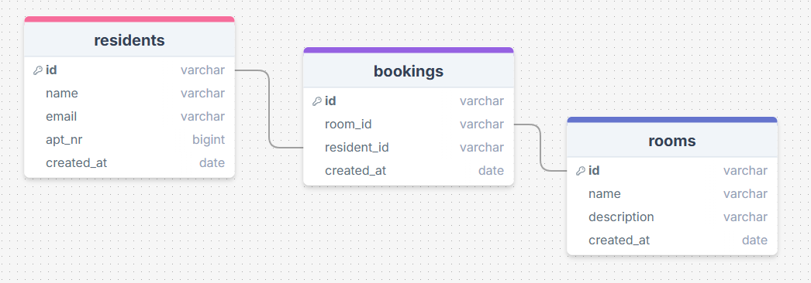

# Booking system for laundry rooms.

### Problem
The booking system at the moment is signing your name on a paper hanging outside of the laundry rooms door. This is not optimal, whoever can pass by and erase someones name and write their own. The residents have to go to the laundry room to see available times and book them. There is a rule that you may only book one pass at the time but there is no way to way if people follow this rule. If someone needs to reschedule the is a low chance that person would go all the way to the laundry room just to erase their own name.

## Solution
Creating a webapp(PWA) to create more availability, better reach and more engagement. It will be easier to reschedule. It will be easier to reach out to residents it there is something faulty with a room.

## Deployments
[Frontend](https://laundry-booking-gamma.vercel.app/)  


## Design
[Here](https://www.figma.com/board/IKHKqr4RaCf8KjO0XaHlmD/Booking-system?node-id=0-1&t=4wGbw7552KR8bFFD-1) you can find  
+ User research
    - User personas
    - User stories
+ Roadmap
+ User flow

## Backend
| PostgreSQL | [Fastify](https://fastify.dev/docs/latest/) | 
(notiser)

### API Design

#### Endpoints:  
GET /users  
_gets all user_  
  
GET /user?user_id=:user_id  
_gets one user_ 
  
POST /user  
_creates a user_  
  
PUT /user?user_id=:user_id  
_updates a user_  
  
DELETE /user?user_id=:user_id  
_deletes a user_  

GET /rooms  
_gets all rooms_ 
  
POST /room  
_creates a new room_  
  
PUT /room?room_id=:room_id  
_updates a room_  
  
DELETE /room?room_id=:room_id  
_deletes a room_ 

GET /bookings  
_gets all bookings_  
  
POST /booking  
_creates a new booking_
  
DELETE /booking  
_deletes a booking_  

#### Response examples:

POST /user
```
message: "New user created",
user: {
    "_id": "12345"
    "name": "Jane Doe",
    "email": "
    "apt_nr": "1205",
}
```

#### Status codes:
```201 Created```: User/Room/Booking created   
```400 Unauthorized```: If something is missing in the parameters  
```401 Unauthorized```: If a user tries to access an admin feature  
```404 Not Found```: If user/room/booking is not found  
```500 Internal Server Error```: If something happens on server side  


## Frontend
